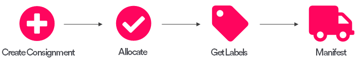

# Consumer Options Flow

The **Consumer Options** flow enables you to provide real-time delivery choices - including delivery date, time, and carrier brand - to your customer at point of purchase. After the customer has chosen their preferred option, PRO can create a consignment based on their details, and allocate that consignment to a carrier service based on the customers choice.

The **Consumer Options** flow is most useful to your business if:

* You want to present your customer with a dynamic checkout that offers delivery timeslot options.
* You operate a single warehouse / fulfilment centre.
* You develop and configure your own e-commerce platform.

There are four steps to the flow:

1. **Get delivery options** - Use the [Delivery Options](https://docs.electioapp.com/#/api/DeliveryOptions) endpoint to request a list of available delivery options for the (as yet uncreated) consignment that the customer's order will generate.
2. **Select delivery option** - Use the [Select Option](https://docs.electioapp.com/#/api/SelectOption) endpoint to tell PRO which option the customer selected. At this point, PRO has all the information it needs to create and allocate a consignment.
3. **Get the consignment's labels** - Use the [Get Labels in Format](https://docs.electioapp.com/#/api/GetLabelsinFormat) endpoint to get the delivery label for your consignment.
4. **Manifest the consignment** - Use the [Manifest Consignments from Query](https://docs.electioapp.com/#/api/ManifestConsignmentsFromQuery) endpoint to confirm the consignment with the selected carrier. At this point, the consignment is ready to ship.

This section gives more detail on each step of the flow and provides worked examples. 
